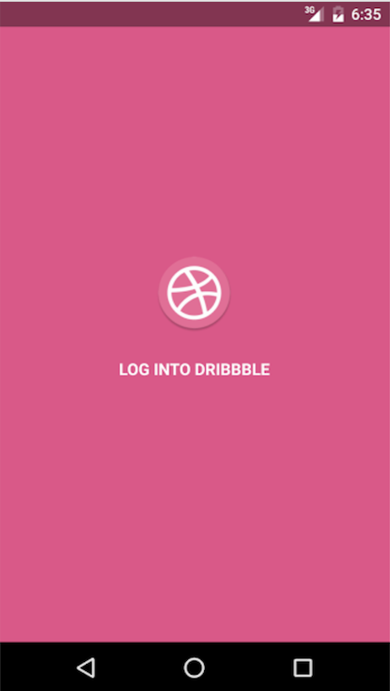
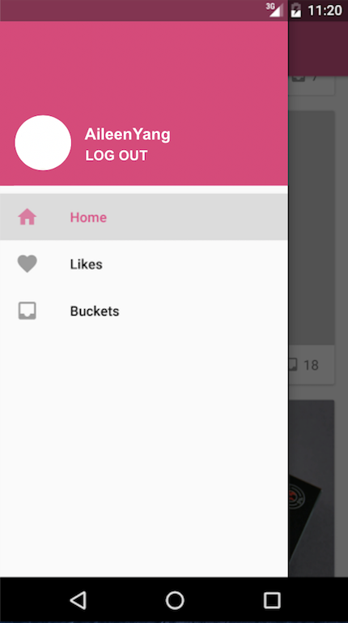
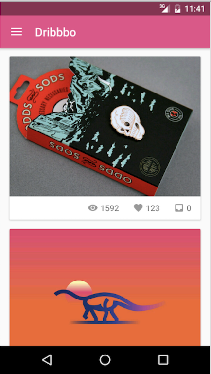
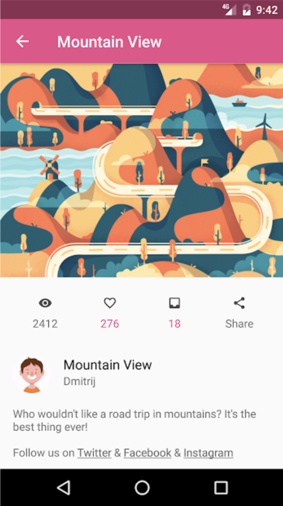
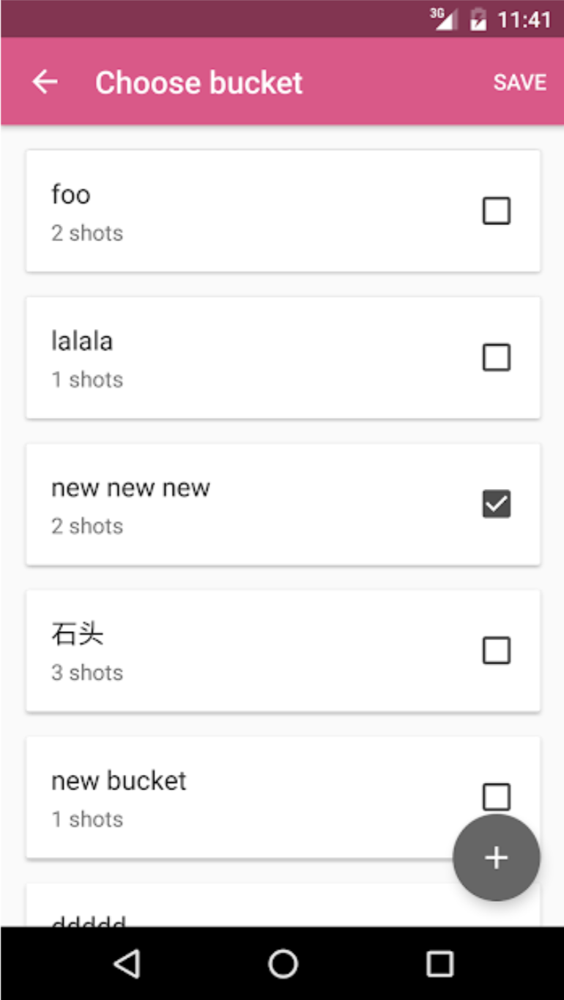

# Dribbble-Pocket

An android app to help designers share their products and learn from each other worldwide.

## Description

* Programming Language & Tools
	* **Java** - constructed the main structure and implementation
	* **Android Studio** - development tool used

* App Sections
	* [Sign up and Login ](#sign-up-and-login)
	* [User Shots Display](#user-shots-display)
	* [Like and Bucket](#like-and-bicket)
	* [Log Out](#log-out)

## Sections
### Sign up and Login
-----------
Users can user their username and password to get into their accounts. 
Used OkHttp and WebView to realize OAuth login, through which users can login with their Dribbble accounts. 

 

### User Shots Display
-----------
Display a list of all the users, from which you can get to see other user's shared photos. 

### Like and Bucket
-----------
Combined Activity, Fragment, Dialog,  AsyncTask with Dribbble API to achieve ‘like’ and ‘bucket’ functions. 
 

### Log Out
-----------
Log out the user's account and go back to the login interface. 

## About me
I am **Aileen Yang** living in **San Francisco Bay Area**, and I have just finished my **master** degree in **NYU** in May 2018. 
I am now ***actively seeking for Software Development Engineer full-time position***. 
Welcome to contact my if you would like to [offer me an oppotunity](mailto:yy1910@nyu.edu)! 
Please feel free to contact me if you have any question.

